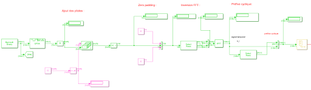
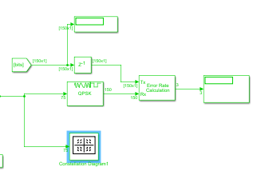

# OFDM simulation using Simulink
This project was carried out as part of the TC department program, INSA Lyon. The goal of the project is to design an OFDM transmitter and a receiver using Simulink, with the use of pilot symbols, cyclic prefix and a multipath channel.

Constraints:
1, Bandwidth: B = 20 MHz; 
2, Environment: In order to introduce multipath channel, we assume that the lastest echo received arrives with a delay of 500 ns (*max delay*) compared to the main path. This correspond to a very dense indoor or outdoor environment; 
3, Maximum Doppler shift: 100 Hz

The transmission being carried out on a multipath channel introducing echoes and delays upon reception, to have a flat fading allowing a constant channel response on a frequency band, the subband width W must respect the following condition: W << 1/*max delay*. For this reason, we chose W = 0.2 MHz.
As a consequence:
Tofdm = 1/W = 5 μs
N = B/W = 100 subbands
Np = N*pilot rate =  25 pilots
Yet the number of samples at the input of the IFFT block must be a multiple of 2, we therefore chose Ntot = 128 and added zeros to the first and last 14 samples of our frame. 
Tb = Tofdm/[2*(N-Np)] = 33 ns
Te = Tofdm/(Npc+Ntot) = 35 ns

The number of cyclic prefix must follow the condition: Npc*Te = *max delay* => Npc = 14 samples

|Parameter | Value |
| --- | --- |
| Number of samples at IFFT block input (Ntot) | 128 | 
| Number of subbands (N) | 100 |
| Subband width (W) | 0.2 MHz  |
| OFDM symbol rate (Tofdm) | 5 μs |
| Bit-rate (Tb) | 33 ns |
| Sample time (Te)| 35 ns |
| Pilot rate | 25% |
| Number of pilots (Np) | 25 |
| Number of cyclic prefix (Npc) | 14 |

The final model is in file Projet_PSC.slx.

## Transmitter

###  Pilot adding principle using Simulink blocs

## Receiver
*First part* 
 
*Second part (Equalization)* 
 
*Third part* 
 

## Channel
A Rayleigh bloc is used for the channel: 

With the configuration below: 
 

The synchronization was carried out in a different project, where we measured the BER with different rates of pilot, IFFT sizes and SNR values.

